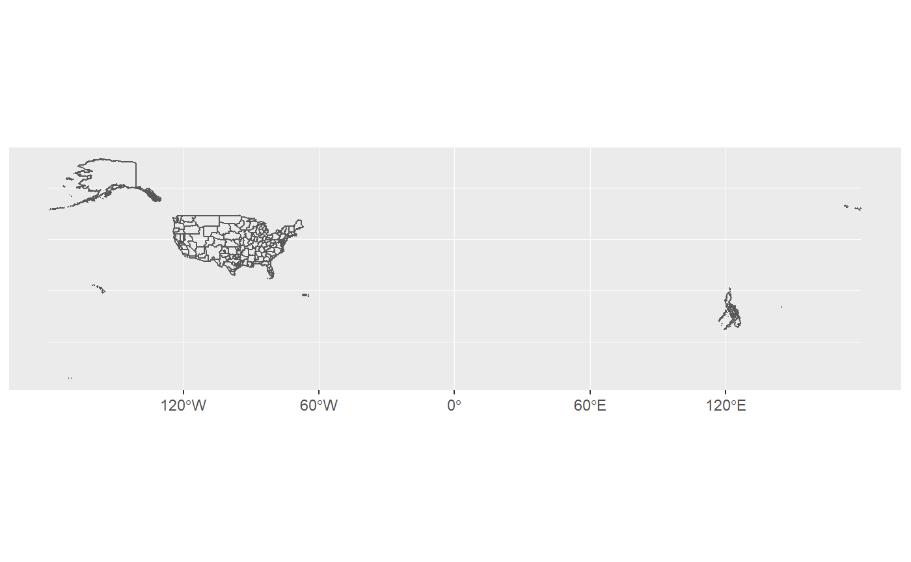
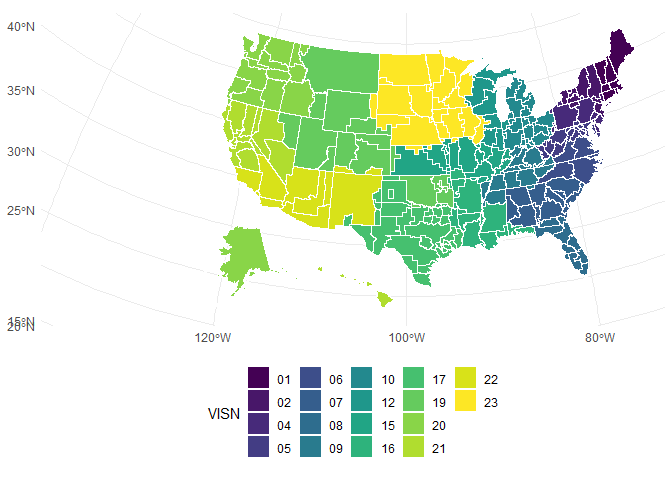
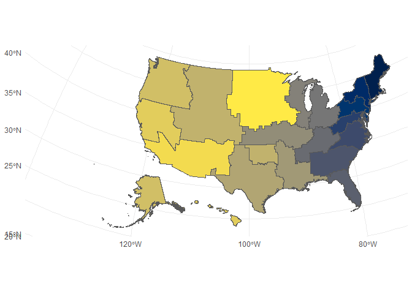
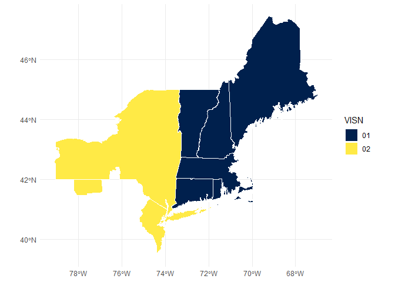
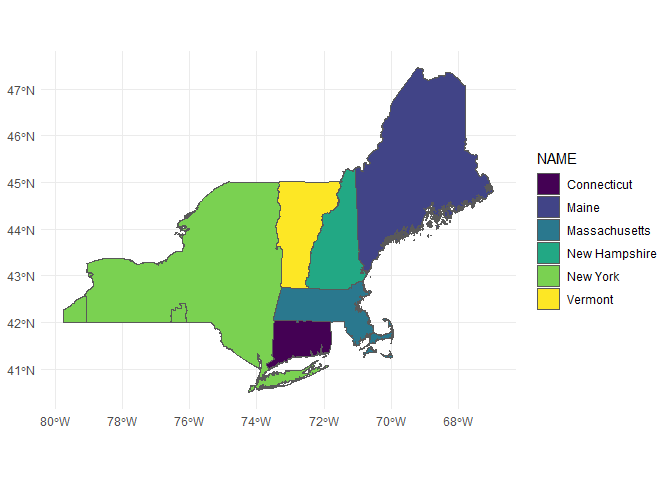
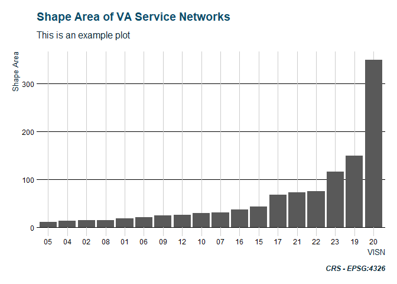
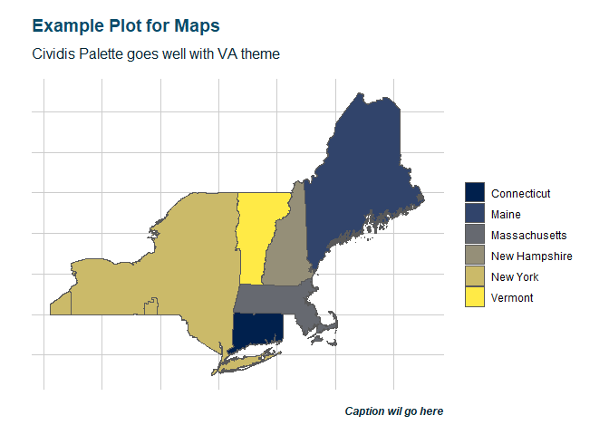

<!-- badges: start -->
[](https://www.tidyverse.org/lifecycle/#experimental) [](https://travis-ci.org/iecastro/tidyVA) <!-- badges: end -->

tidyVA
======

The goal of **tidyVA** is to provide [simple features](https://r-spatial.github.io/sf/articles/sf1.html) of Veterans Health Administration geographies. Data included are *tidy* dataframes of VHA spatial data obtained from [data.va.gov](https://www.data.va.gov/dataset/veterans-integrated-services-networks-visn-markets-submarkets-sectors-and-counties).

The benefit of simple features in R is that they allow for [tidy spatial analysis](https://edzer.github.io/UseR2017/geostat2018.html#tidyverse-list-columns).

Installation
------------

You can install **tidyVA** from GitHub with:

``` r
devtools::install_github("iecastro/tidyVA")
```

Datasets
--------

The following datasets have been converted to sf tibbles and have a common CRS - EPSG: 4326.

Summarized descriptions from [data.va.gov](https://www.data.va.gov/dataset/veterans-integrated-services-networks-visn-markets-submarkets-sectors-and-counties)

-`county`: The county layer is the base geographic unit of the VISN-Market-Submarket-Sector-County hierarchy.

-`sector`: A sector is a cluster of geographically adjacent counties within a VA Submarket.

-`submarket`: Submarkets reflect a clustering of the enrollee population within a market and are an aggregation of Sectors.

-`market`: Each market is built from submarkets and represent an aggregated geographic area having sufficient population and geographic size to benefit from planning healthcare services. Markets cross state borders where neccesary to keep the catchment area within the same market

-`visn`: VISNs are the upper echelon in the VHA hierarchy. VISN boundaries align with those of their constituent markets and can span across non-contiguous areas.

### Other Data

-`states`: Simple features of states and territories of the US (CRS - EPSG: 4326). Used for spatial joins and geometric manipulations.

-`VAloc`: Simple features (CRS - EPSG: 4326) of all VA facilities - from all Administrations: Veterans Health Administration, Veterans Benefits Administration, and National Cemetery Administration

Example
-------

This is a basic example which shows you how to solve a common problem:

VHA Submarkets are an aggregation of Sectors; and Sectors are comprised of one or more counties. Since each VISN is defined in a hierarchy, this dataset contains attributes of all echelons above submarket - that is, Market and VISN.

``` r
library(ggplot2)
#> Warning: package 'ggplot2' was built under R version 3.5.2
library(dplyr)
#> Warning: package 'dplyr' was built under R version 3.5.2
#> 
#> Attaching package: 'dplyr'
#> The following objects are masked from 'package:stats':
#> 
#>     filter, lag
#> The following objects are masked from 'package:base':
#> 
#>     intersect, setdiff, setequal, union
library(tidyVA)

data("submarket")

ggplot() + geom_sf(data=submarket, fill = NA)
```



Although accurate, this output is not very easy to work with. But, since this is now in tidy format, we can easily filter and manipulate the data. The major function in **tidyVA**: `shift_geo()` will project and repositon Alaska and Hawaii.

*Functionality for other locations served by VHA (i.e. Guam and Puerto Rico, among others) is in development*

``` r
shift_geo(submarket) %>% 
  ggplot() + geom_sf(fill = NA) +
  theme_minimal()
#> Warning: attribute variables are assumed to be spatially constant
#> throughout all geometries
#> Warning: package 'bindrcpp' was built under R version 3.5.2
#> Please note: Alaska and Hawaii are being shifted and are not to scale.
```


If you create an R object, this object can be mapped multiple times as individual layers:

``` r
submarket <- shift_geo(submarket)
#> Warning: attribute variables are assumed to be spatially constant
#> throughout all geometries
#> Please note: Alaska and Hawaii are being shifted and are not to scale.

ggplot() + 
  # layer 1 is mapped to represent VISNs
  geom_sf(data = submarket, aes(fill = VISN), color = NA) +  
  # layer 2 is mapped to show all submarkets 
  geom_sf(data = submarket, fill = NA, color = "#ffffff", size = .5) + 
  theme_minimal() + theme(legend.position = "bottom") +
  scale_fill_viridis_d()
```



Alternatively, you can aggregate this dataset to the VISN level, and use as needed. Keep in mind that VHA submarkets in the Caribbean and the Pacific Ocean, are not included - thus, VISNs 21 and 8 are not fully represented.

``` r
visn <- submarket %>% group_by(VISN) %>% summarise()

ggplot() + geom_sf(data = visn, aes(fill = VISN), show.legend = FALSE) +
 theme_minimal() + scale_fill_viridis_d(option = "cividis")
```



### Spatial intersection

A major limitation of the original data is that attributes were present based on a geography's hierachy. The `county` dataset has VHA attributes in addition to State and County attributes. The `visn` dataset only has a VISN attribute:

``` r
data("states")
data("visn")

glimpse(visn)
#> Observations: 18
#> Variables: 4
#> $ VISN       <chr> "01", "02", "04", "05", "06", "07", "08", "09", "10...
#> $ Shape_Leng <dbl> 133.20427, 80.95749, 48.00316, 97.94793, 166.43208,...
#> $ Shape_Area <dbl> 19.12818, 15.28981, 14.14237, 12.04503, 21.12288, 3...
#> $ geometry   <MULTIPOLYGON [°]> MULTIPOLYGON (((-73.62286 4..., MULTI...
```

With simple features we can easily perform geometric operations and gather attributes based on a spatial relationship:

``` r
visn_st <- st_intersection(states, visn)
#> although coordinates are longitude/latitude, st_intersection assumes that they are planar
#> Warning: attribute variables are assumed to be spatially constant
#> throughout all geometries

glimpse(visn_st)
#> Observations: 151
#> Variables: 13
#> $ STATEFP    <chr> "09", "50", "23", "25", "33", "36", "44", "09", "34...
#> $ STATENS    <chr> "01779780", "01779802", "01779787", "00606926", "01...
#> $ AFFGEOID   <chr> "0400000US09", "0400000US50", "0400000US23", "04000...
#> $ GEOID      <chr> "09", "50", "23", "25", "33", "36", "44", "09", "34...
#> $ STUSPS     <chr> "CT", "VT", "ME", "MA", "NH", "NY", "RI", "CT", "NJ...
#> $ NAME       <chr> "Connecticut", "Vermont", "Maine", "Massachusetts",...
#> $ LSAD       <chr> "00", "00", "00", "00", "00", "00", "00", "00", "00...
#> $ ALAND      <dbl> 12542638347, 23873467535, 79885221885, 20204442852,...
#> $ AWATER     <dbl> 1815476291, 1031124865, 11748755195, 7130620748, 10...
#> $ VISN       <chr> "01", "01", "01", "01", "01", "01", "01", "02", "02...
#> $ Shape_Leng <dbl> 133.20427, 133.20427, 133.20427, 133.20427, 133.204...
#> $ Shape_Area <dbl> 19.12818, 19.12818, 19.12818, 19.12818, 19.12818, 1...
#> $ geometry   <GEOMETRY [°]> MULTIPOLYGON (((-72.75991 4..., POLYGON (...
```

We can now filter this dataframe by VISN and keep State attributes

``` r

visn_st %>% filter(VISN %in% c("01","02")) %>% 
  ggplot() + geom_sf(aes(fill = VISN), color = "#ffffff") +
  scale_fill_viridis_d(option = "cividis") +
  theme_minimal()
```



Or by State, and keeping VISN attributes. New York for example is mostly within VISN 2, but, there are small catchments areas in the Western and Southern parts of the state that are outside VISN 2.

``` r

visn_st %>% filter(STUSPS %in% c("NY","CT","VT","ME", "MA","NH")) %>% 
  ggplot() + geom_sf(aes(fill = NAME)) +
  scale_fill_viridis_d() +
  theme_minimal()
```



Theme Function
--------------

**tidyVA** also includes a ggplot themes: `theme_va()`.

This is theme has several possible parameters. The core of this function is `theme_ipsum` from [hrbrthemes](https://hrbrmstr.github.io/hrbrthemes/), but I have modified and set some defaults.

``` r
data("visn")

visn %>% ggplot(aes(reorder(VISN,Shape_Area), Shape_Area)) +
  geom_col() + labs(x = "VISN", y = "Shape Area", caption = "CRS - EPSG:4326") +
  ggtitle("Shape Area of VA Service Networks", subtitle = "This is an example plot") +
  theme_va(grid = "X")
```



### Map Theme

When plotting maps, you may want to remove the axis text from geom\_sf(). For this, the `map` argument of `theme_va()` can be set to TRUE.

``` r
visn_st %>% filter(STUSPS %in% c("NY","CT","VT","ME", "MA","NH")) %>% 
  ggplot() + geom_sf(aes(fill = NAME)) +
  scale_fill_viridis_d(option = "cividis") +
  labs(caption = "Caption wil go here", fill = "") +
  ggtitle("Example Plot for Maps", 
          subtitle = "Cividis Pallete goes well with VA theme") +
  theme_va(map = TRUE) 
```



Info
====

Development of this package is partly supported by a research grant from the National Institute on Alcohol Abuse and Alcoholism - NIH Grant \#R34AA026745-01.

This product is not endorsed nor certified by either the VA or NIH/NIAAA.
