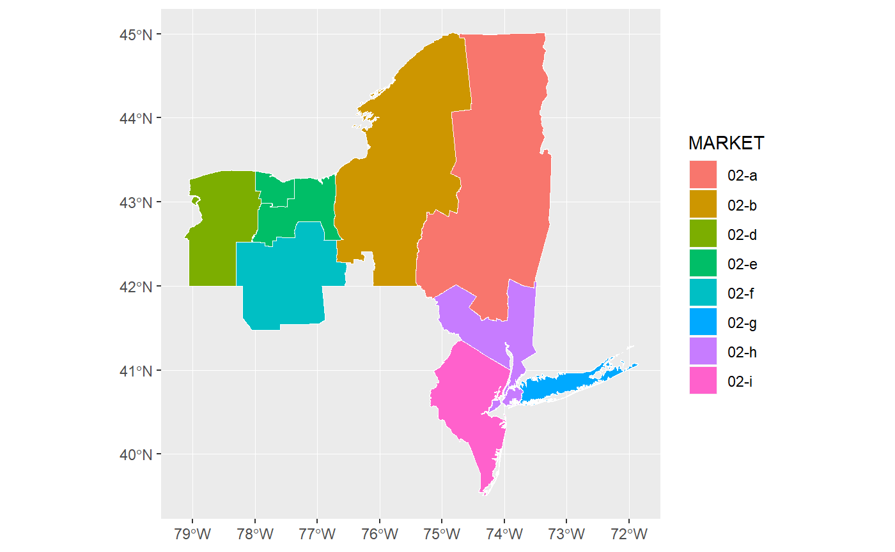

<!-- badges: start -->
[](https://www.tidyverse.org/lifecycle/#experimental) [](https://travis-ci.org/iecastro/tidyVA) <!-- badges: end -->

tidyVA
======

The goal of **tidyVA** is to provide [simple features](https://r-spatial.github.io/sf/articles/sf1.html) of Veterans Health Administration geographies. Data included are *tidy* dataframes of VHA spatial data obtained from [data.va.gov](https://www.data.va.gov/dataset/veterans-integrated-services-networks-visn-markets-submarkets-sectors-and-counties).

The benefit of simple features in R is that they allow for [tidy spatial analysis](https://edzer.github.io/UseR2017/geostat2018.html#tidyverse-list-columns).

Installation
============

You can install **tidyVA** from GitHub with:

``` r
remotes::install_github("iecastro/tidyVA")
```

Datasets
========

VHA Geographies
---------------

The following included datasets are sf tibbles of VHA geographies and have a common CRS - EPSG: 4326.

Summarized descriptions from [data.va.gov](https://www.data.va.gov/dataset/veterans-integrated-services-networks-visn-markets-submarkets-sectors-and-counties)

`county`: The county layer is the base geographic unit of the VISN-Market-Submarket-Sector-County hierarchy.

`sector`: A sector is a cluster of geographically adjacent counties within a VA Submarket.

`submarket`: Submarkets reflect a clustering of the enrollee population within a market and are an aggregation of Sectors.

`market`: Each market is built from submarkets and represent an aggregated geographic area having sufficient population and geographic size to benefit from planning healthcare services. Markets cross state borders where neccesary to keep the catchment area within the same market

`visn`: VISNs are the upper echelon in the VHA hierarchy. VISN boundaries align with those of their constituent markets and can span across non-contiguous areas.

### Other Data

`states`: Simple features of states and territories of the US (CRS - EPSG: 4326). Used for spatial joins and geometric manipulations.

`VAloc`: Simple features (CRS - EPSG: 4326) of all VA facilities - from all Administrations: Veterans Health Administration, Veterans Benefits Administration, and National Cemetery Administration

Example
-------

This is a basic example which shows you how to solve a common problem:

VHA Submarkets are an aggregation of Sectors; and Sectors are comprised of one or more counties. Since each VISN is defined in a hierarchy, this dataset contains attributes of all echelons above submarket - that is, Market and VISN.

``` r
library(ggplot2)
#> Warning: package 'ggplot2' was built under R version 3.5.2
library(dplyr)
#> Warning: package 'dplyr' was built under R version 3.5.2
#> 
#> Attaching package: 'dplyr'
#> The following objects are masked from 'package:stats':
#> 
#>     filter, lag
#> The following objects are masked from 'package:base':
#> 
#>     intersect, setdiff, setequal, union
library(tidyVA)

data("submarket")

ggplot() + geom_sf(data=submarket, fill = NA)
```


Although accurate, this output is not very easy to work with. But, since this is in tidy format, we can easily filter and manipulate the data.

``` r
glimpse(submarket)
#> Observations: 153
#> Variables: 6
#> $ VISN       <chr> "01", "01", "01", "01", "02", "02", "02", "02", "02...
#> $ MARKET     <chr> "01-a", "01-b", "01-c", "01-d", "02-a", "02-b", "02...
#> $ SUBMARKET  <chr> "01-a-9", "01-b-9", "01-c-9", "01-d-9", "02-a-9", "...
#> $ Shape_Leng <dbl> 38.391428, 81.160361, 13.413957, 14.839457, 13.0815...
#> $ Shape_Area <dbl> 1.78751288, 9.66806953, 5.47709016, 2.19550641, 4.9...
#> $ geometry   <MULTIPOLYGON [°]> MULTIPOLYGON (((-71.56974 4..., MULTI...
```

``` r
visn2 <- submarket %>% filter(VISN == "02")
#> Warning: package 'bindrcpp' was built under R version 3.5.2
visn2
#> Simple feature collection with 10 features and 5 fields
#> geometry type:  MULTIPOLYGON
#> dimension:      XY
#> bbox:           xmin: -79.13745 ymin: 39.50577 xmax: -71.85615 ymax: 45.01585
#> epsg (SRID):    4326
#> proj4string:    +proj=longlat +datum=WGS84 +no_defs
#> # A tibble: 10 x 6
#>    VISN  MARKET SUBMARKET Shape_Leng Shape_Area                    geometry
#>    <chr> <chr>  <chr>          <dbl>      <dbl>         <MULTIPOLYGON [°]>
#>  1 02    02-a   02-a-9         13.1      4.91   (((-73.34312 45.01084, -73~
#>  2 02    02-b   02-b-9         18.8      4.01   (((-76.18704 43.66566, -76~
#>  3 02    02-d   02-d-9          6.58     1.25   (((-78.90518 42.93351, -78~
#>  4 02    02-e   02-e-1          2.49     0.191  (((-77.97621 43.36874, -77~
#>  5 02    02-e   02-e-2          6.01     0.656  (((-76.94668 43.25894, -76~
#>  6 02    02-f   02-f-2          6.14     1.63   (((-76.94756 42.76441, -76~
#>  7 02    02-g   02-g-9         25.2      0.335  (((-73.72961 40.59637, -73~
#>  8 02    02-h   02-h-1          9.51     0.999  (((-73.89687 40.79565, -73~
#>  9 02    02-h   02-h-3          5.92     0.0717 (((-74.20241 40.57956, -74~
#> 10 02    02-i   02-i-9         17.4      1.24   (((-74.30019 39.50628, -74~
```

``` r
ggplot() + 
  geom_sf(data=visn2, aes(fill = MARKET), color = NA) +
  geom_sf(data = visn2, fill = NA, color = "#ffffff", size = .25)
```



Functions
=========

`shift_geo()` will project and reposition Alaska and Hawaii, When supplied a complete dataset (from VHA Geographies).

`theme_va()` is a ggplot theme with some default colors and plotting parameters. The core of this function is `theme_ipsum` from [hrbrthemes](https://hrbrmstr.github.io/hrbrthemes/), with some modifications and defaults.

### Harvest functions

These functions serve as a homebrewed API for fetching Hospital Performance datasets. VA Open Data uses a harvesting framework from [DKAN](https://docs.getdkan.com/en/latest/components/harvest.html). Currently the [VHA Harvest](https://www.data.va.gov/harvest_source/vha-harvest-datasets) only includes hospital performance datasets.

`harvest_get()` will return a tibble of URLs and attributes for each dataset.

`harvest_wrngl()` will import and tidy datasets from an object created with `harvest_get`

Examples
--------

### `shift_geo`

``` r
shift_geo(submarket) %>% 
  ggplot() + geom_sf(fill = NA) +
  theme_minimal()
#> Warning: attribute variables are assumed to be spatially constant
#> throughout all geometries
#> Please note: Alaska and Hawaii are being shifted and are not to scale.
```


### `theme_va`

``` r
data("visn")

visn %>% ggplot(aes(reorder(VISN,Shape_Area), Shape_Area)) +
  geom_col() + labs(x = "VISN", y = "Shape Area", caption = "CRS - EPSG:4326") +
  ggtitle("Shape Area of VA Service Networks", subtitle = "This is an example plot") +
  theme_va(grid = "X")
```


### `harvest_get`

This function is a wrapper for `filter` so that queries can be built. If no arguments are entered, all available datasets are returned.

``` r
links <- harvest_get(Year == "2018" & VISN == "VISN 2")
#> Warning: Expected 2 pieces. Additional pieces discarded in 438 rows [1, 2,
#> 3, 4, 5, 6, 7, 8, 9, 10, 11, 12, 13, 14, 15, 16, 17, 18, 19, 20, ...].

links
#> # A tibble: 22 x 6
#>    VISN   Site     downloadURL                         format Year  Quarter
#>    <chr>  <chr>    <chr>                               <chr>  <chr> <chr>  
#>  1 VISN 2 Albany   https://www.va.gov/QUALITYOFCARE/S~ XLS    2018  1      
#>  2 VISN 2 Bath     https://www.va.gov/QUALITYOFCARE/S~ XLS    2018  1      
#>  3 VISN 2 Bronx    https://www.va.gov/QUALITYOFCARE/S~ XLS    2018  1      
#>  4 VISN 2 Brooklyn https://www.va.gov/QUALITYOFCARE/S~ XLS    2018  1      
#>  5 VISN 2 Buffalo  https://www.va.gov/QUALITYOFCARE/S~ XLS    2018  1      
#>  6 VISN 2 Cananda~ https://www.va.gov/QUALITYOFCARE/S~ XLS    2018  1      
#>  7 VISN 2 East Or~ https://www.va.gov/QUALITYOFCARE/S~ XLS    2018  1      
#>  8 VISN 2 Hudson ~ https://www.va.gov/QUALITYOFCARE/S~ XLS    2018  1      
#>  9 VISN 2 New York https://www.va.gov/QUALITYOFCARE/S~ XLS    2018  1      
#> 10 VISN 2 Northpo~ https://www.va.gov/QUALITYOFCARE/S~ XLS    2018  1      
#> # ... with 12 more rows
```

### `harvest_wrngl`

``` r
data <- harvest_wrngl(links) #object created with harvest_get()
#> readxl works best with a newer version of the tibble package.
#> You currently have tibble v1.4.2.
#> Falling back to column name repair from tibble <= v1.4.2.
#> Message displays once per session.

data
#> # A tibble: 1,562 x 9
#>    Measure `Measure Unit` Benchmark `10th-50th-90th~ Site.x Value VISN 
#>    <chr>   <chr>          <chr>     <chr>            <chr>  <chr> <chr>
#>  1 Acute ~ <NA>           <NA>      <NA>             Albany <NA>  VISN~
#>  2 1. Acu~ O/E            0.480     0.480 - 0.890 -~ Albany 0.943 VISN~
#>  3 2. Acu~ O/E            0.727     0.727 - 0.960 -~ Albany 0.907 VISN~
#>  4 a. AMI~ %              7.003     7.003 - 7.967 -~ Albany 8.320 VISN~
#>  5 b. CHF~ %              4.870     4.870 - 5.970 -~ Albany 7.201 VISN~
#>  6 c. Pne~ %              17.195    17.195 - 18.393~ Albany 18.2~ VISN~
#>  7 d. COP~ %              3.757     3.757 - 4.725 -~ Albany 5.244 VISN~
#>  8 Avoida~ <NA>           <NA>      <NA>             Albany <NA>  VISN~
#>  9 1. In-~ O/E            0.231     0.231 - 0.922 -~ Albany 1.066 VISN~
#> 10 2. Hea~ <NA>           <NA>      <NA>             Albany <NA>  VISN~
#> # ... with 1,552 more rows, and 2 more variables: Year <chr>,
#> #   Quarter <chr>
```

Info
====

Development of this package is partly supported by a research grant from the National Institute on Alcohol Abuse and Alcoholism - NIH Grant \#R34AA026745-01.

This product is not endorsed nor certified by either the VA or NIH/NIAAA.
