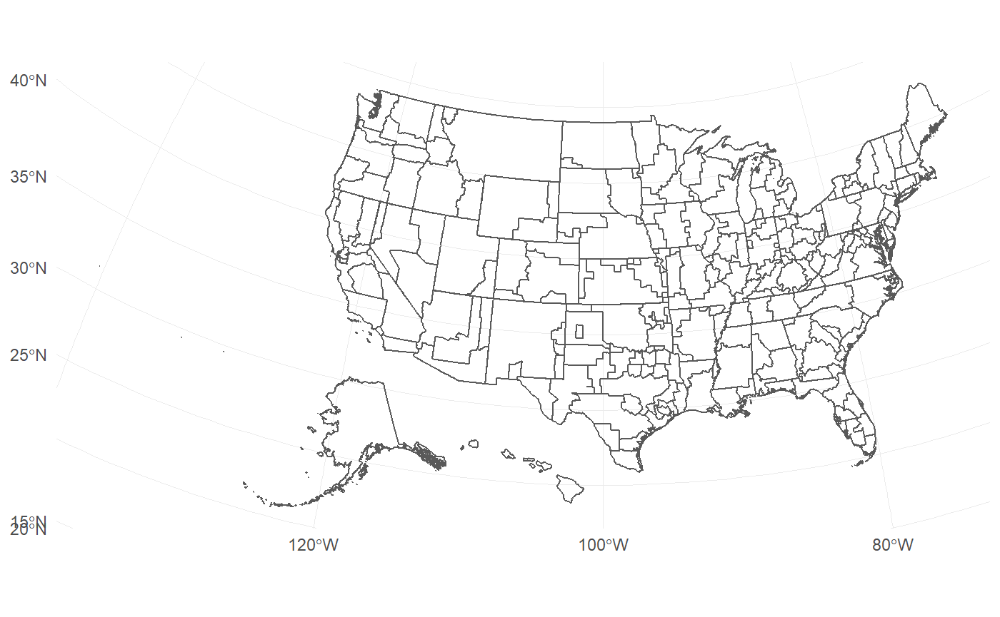

<!-- badges: start -->

[](https://www.tidyverse.org/lifecycle/#maturing)
[](https://travis-ci.org/iecastro/tidyVA)
[](https://ci.appveyor.com/project/iecastro/tidyVA)
<!-- badges: end -->

# tidyVA

The goal of **tidyVA** is to provide [simple
features](https://r-spatial.github.io/sf/articles/sf1.html) of Veterans
Health Administration geographies. Data included are tidy data frames of
VHA spatial data obtained from
[data.va.gov](https://www.data.va.gov/dataset/veterans-integrated-services-networks-visn-markets-submarkets-sectors-and-counties).
*Please note the site is no longer operational while VA establishes a
new open data portal.*

The benefit of simple features in R is that they allow for [tidy spatial
analysis](https://edzer.github.io/UseR2017/geostat2018.html#tidyverse-list-columns).

# Installation

You can install **tidyVA** from GitHub with:

``` r
remotes::install_github("iecastro/tidyVA")
```

# Datasets

## VHA Geographies

The following included datasets are sf-tibbles of VHA geographies with a
common CRS - EPSG: 4326.

Summarized descriptions from
[data.va.gov](https://www.data.va.gov/dataset/veterans-integrated-services-networks-visn-markets-submarkets-sectors-and-counties)

`county`: The county layer is the base geographic unit of the
VISN-Market-Submarket-Sector-County hierarchy.

`sector`: A sector is a cluster of geographically adjacent counties
within a VA Submarket.

`submarket`: Submarkets reflect a clustering of the enrolled population
within a market and are an aggregation of Sectors.

`market`: Each market is built from submarkets and represent an
aggregated geographic area having sufficient population and geographic
size to benefit from planning healthcare services. Markets cross state
borders where necessary to keep the catchment area within the same
market

`visn`: VISNs are the upper echelon in the VHA hierarchy. VISN
boundaries align with those of their constituent markets and can span
across non-contiguous areas.

### Other Data

`states`: Simple features of states and territories of the US (CRS -
EPSG: 4326). Used for spatial joins and geometric manipulations.

`VAloc`: Simple features (CRS - EPSG: 4326) of all VA facilities - from
all Administrations: Veterans Health Administration, Veterans Benefits
Administration, and National Cemetery Administration

## Example

This is a basic example which shows you how to solve a common problem:

VHA Submarkets are an aggregation of Sectors; and Sectors are comprised
of one or more counties. Since each VISN is defined in a hierarchy, this
dataset contains attributes of all echelons above submarket - that is,
Market and VISN.

``` r
library(ggplot2)
library(dplyr)
library(tidyVA)

data("submarket")
```

``` r

ggplot() + 
  geom_sf(data = submarket, fill = NA)
```


Although accurate, this output is not very easy to work with. Since this
is in tidy format, though, we can easily filter and manipulate the data.

``` r
glimpse(submarket)
#> Observations: 153
#> Variables: 6
#> $ VISN       <chr> "01", "01", "01", "01", "02", "02", "02", "02", "02", "0...
#> $ MARKET     <chr> "01-a", "01-b", "01-c", "01-d", "02-a", "02-b", "02-d", ...
#> $ SUBMARKET  <chr> "01-a-9", "01-b-9", "01-c-9", "01-d-9", "02-a-9", "02-b-...
#> $ Shape_Leng <dbl> 38.391428, 81.160361, 13.413957, 14.839457, 13.081583, 1...
#> $ Shape_Area <dbl> 1.78751288, 9.66806953, 5.47709016, 2.19550641, 4.907932...
#> $ geometry   <MULTIPOLYGON [°]> MULTIPOLYGON (((-71.56974 4..., MULTIPOLYGO...
```

``` r
visn2 <- submarket %>% 
  filter(VISN == "02")

visn2
```

    #> Simple feature collection with 10 features and 5 fields
    #> geometry type:  MULTIPOLYGON
    #> dimension:      XY
    #> bbox:           xmin: -79.13745 ymin: 39.50577 xmax: -71.85615 ymax: 45.01585
    #> epsg (SRID):    4326
    #> proj4string:    +proj=longlat +datum=WGS84 +no_defs
    #> # A tibble: 10 x 6
    #>    VISN  MARKET SUBMARKET Shape_Leng Shape_Area                         geometry
    #>  * <chr> <chr>  <chr>          <dbl>      <dbl>               <MULTIPOLYGON [°]>
    #>  1 02    02-a   02-a-9         13.1      4.91   (((-73.34312 45.01084, -73.3446~
    #>  2 02    02-b   02-b-9         18.8      4.01   (((-76.18704 43.66566, -76.1869~
    #>  3 02    02-d   02-d-9          6.58     1.25   (((-78.90518 42.93351, -78.9050~
    #>  4 02    02-e   02-e-1          2.49     0.191  (((-77.97621 43.36874, -77.9753~
    #>  5 02    02-e   02-e-2          6.01     0.656  (((-76.94668 43.25894, -76.9463~
    #>  6 02    02-f   02-f-2          6.14     1.63   (((-76.94756 42.76441, -76.9477~
    #>  7 02    02-g   02-g-9         25.2      0.335  (((-73.72961 40.59637, -73.7289~
    #>  8 02    02-h   02-h-1          9.51     0.999  (((-73.89687 40.79565, -73.8970~
    #>  9 02    02-h   02-h-3          5.92     0.0717 (((-74.20241 40.57956, -74.2023~
    #> 10 02    02-i   02-i-9         17.4      1.24   (((-74.30019 39.50628, -74.3048~

``` r
ggplot() + 
  geom_sf(data = visn2, 
          aes(fill = MARKET), 
          color = NA) +
  geom_sf(data = visn2, 
          fill = NA, 
          color = "#ffffff", 
          size = .25)
  
```


# Some Functions

### `shift_geo`

`shift_geo()` will project and re-position Alaska and Hawaii, When
supplied a complete dataset (from VHA Geographies).

``` r
shift_geo(submarket) %>% 
  ggplot() + 
  geom_sf(fill = NA) +
  theme_minimal()
```



### `theme_va()`

`theme_va()` is a copy of `theme_ipsum` from
[hrbrthemes](https://hrbrmstr.github.io/hrbrthemes/). It’s a ggplot
theme with some color and plotting modifications to the defaults.

``` r
data("visn")

visn %>% 
  ggplot(aes(reorder(VISN,Shape_Area), Shape_Area)) +
  geom_col() + 
  labs(x = "VISN", y = "Shape Area", 
       caption = "CRS - EPSG:4326") +
  ggtitle("Shape Area of VA Service Networks", 
          subtitle = "This is an example plot") +
  theme_va(grid = "Y")
```


### `sail_tidy`

`sail_tidy` will return a tibble of VA SAIL metrics when provided a
[data table
url](https://www.va.gov/QUALITYOFCARE/measure-up/Strategic_Analytics_for_Improvement_and_Learning_SAIL.asp).

``` r
sail_tidy("https://www.va.gov/QUALITYOFCARE/SAIL_FY19_Q1/SAIL-5_clarksburg_fy19q1.xlsx")
#> # A tibble: 63 x 8
#>    label measure_unit preferred_direc~ best_10_percent ntiles_10_50_90 site 
#>    <chr> <chr>        <chr>            <chr>           <chr>           <chr>
#>  1 Acut~ O/E          <U+2193>                0.469           0.469 - 0.857 ~ Clar~
#>  2 Acut~ O/E          <U+2193>                0.740           0.740 - 0.952 ~ Clar~
#>  3 AMI ~ %            <U+2193>                7.219           7.219 - 7.666 ~ Clar~
#>  4 CHF ~ %            <U+2193>                5.676           5.676 - 6.820 ~ Clar~
#>  5 Pneu~ %            <U+2193>                7.820           7.820 - 9.026 ~ Clar~
#>  6 COPD~ %            <U+2193>                4.402           4.402 - 5.942 ~ Clar~
#>  7 Stro~ %            <U+2193>                5.134           5.134 - 5.933 ~ Clar~
#>  8 In-h~ O/E          <U+2193>                0.000           0.000 - 0.834 ~ Clar~
#>  9 Cath~ inf/1k devi~ <U+2193>                0.000           0.000 - 0.446 ~ Clar~
#> 10 Cent~ inf/1k devi~ <U+2193>                0.000           0.000 - 0.395 ~ Clar~
#> # ... with 53 more rows, and 2 more variables: value <chr>, measure <chr>
```

# Info

Development of this package partly supported by a research grant from
the National Institute on Alcohol Abuse and Alcoholism - NIH Grant
\#R34AA026745-01.

This product is not endorsed nor certified by either VA or NIH/NIAAA.
