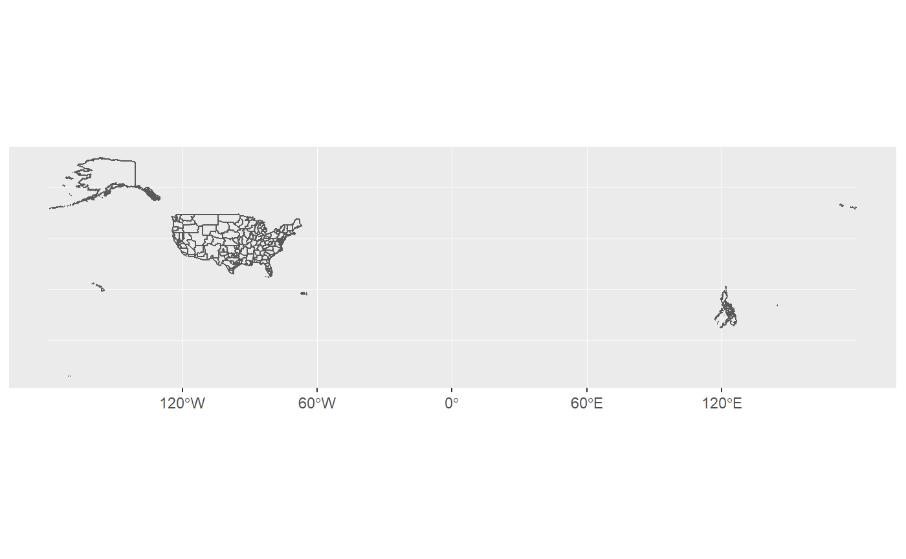
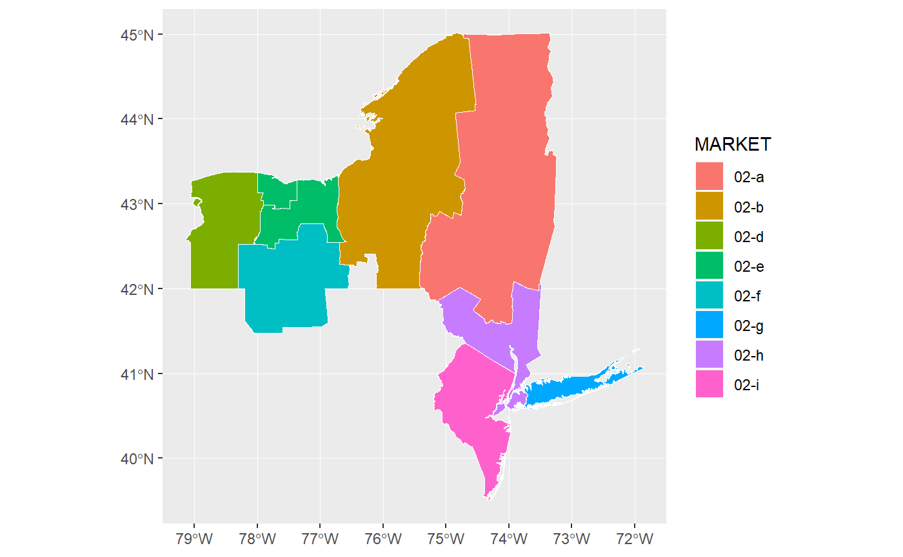
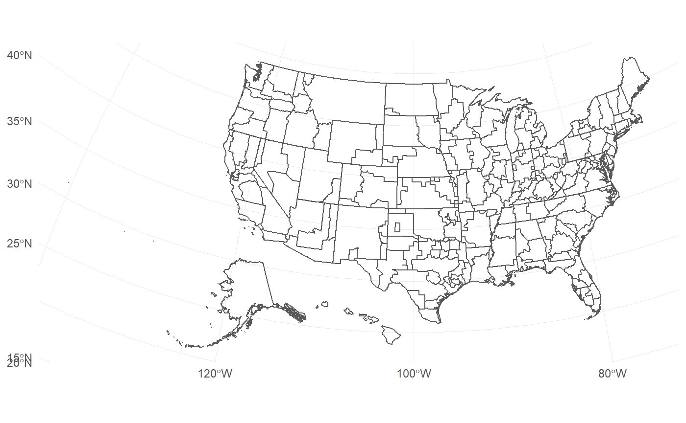
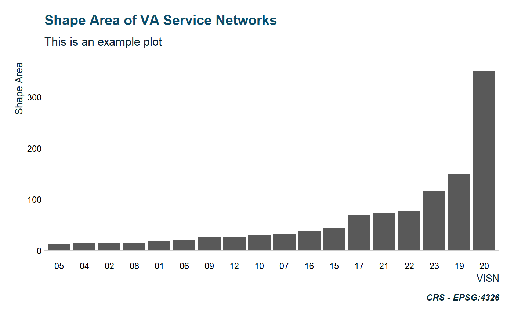

<!-- badges: start -->
[](https://www.tidyverse.org/lifecycle/#experimental)
[](https://travis-ci.org/iecastro/tidyVA)
[](https://www.tidyverse.org/lifecycle/#maturing)
<!-- badges: end -->


```{r setup, include = FALSE}
knitr::opts_chunk$set(
  collapse = TRUE,
  comment = "#>",
  fig.path = "man/figures/README-",
  out.width = "100%",
  warning = FALSE
)

devtools::load_all()
library(ggplot2)
library(dplyr)

```
# tidyVA

The goal of **tidyVA** is to provide [simple features](https://r-spatial.github.io/sf/articles/sf1.html) of Veterans Health Administration geographies.  Data included are *tidy* data frames of VHA spatial data obtained from [data.va.gov](https://www.data.va.gov/dataset/veterans-integrated-services-networks-visn-markets-submarkets-sectors-and-counties).

The benefit of simple features in R is that they allow for [tidy spatial analysis](https://edzer.github.io/UseR2017/geostat2018.html#tidyverse-list-columns).

# Installation

You can install **tidyVA** from GitHub with:


```{r eval=FALSE}
remotes::install_github("iecastro/tidyVA")
```

# Datasets

## VHA Geographies 

The following included datasets are sf tibbles of VHA geographies and have a common CRS - EPSG: 4326.

Summarized descriptions from [data.va.gov](https://www.data.va.gov/dataset/veterans-integrated-services-networks-visn-markets-submarkets-sectors-and-counties)


`county`: The county layer is the base geographic unit of the VISN-Market-Submarket-Sector-County hierarchy. 

`sector`: A sector is a cluster of geographically adjacent counties within a VA Submarket.

`submarket`: Submarkets reflect a clustering of the enrolled population within a market and are an aggregation of Sectors.

`market`: Each market is built from submarkets and represent an aggregated geographic area having sufficient population and geographic size to benefit from planning healthcare services. Markets cross state borders where necessary to keep the catchment area within the same market 

`visn`: VISNs are the upper echelon in the VHA hierarchy. VISN boundaries align with those of their constituent markets and can span across non-contiguous areas.

### Other Data

`states`: Simple features of states and territories of the US (CRS - EPSG: 4326).  Used for spatial joins and geometric manipulations.

`VAloc`: Simple features (CRS - EPSG: 4326) of all VA facilities - from all Administrations: Veterans Health Administration, Veterans Benefits Administration, and National Cemetery Administration


## Example

This is a basic example which shows you how to solve a common problem:

VHA Submarkets are an aggregation of Sectors; and Sectors are comprised of one or more counties. Since each VISN is defined in a hierarchy, this dataset contains attributes of all echelons above submarket - that is, Market and VISN.


```{r example}
library(ggplot2)
library(dplyr)
library(tidyVA)

data("submarket")

```

```{r eval=FALSE}

ggplot() + 
  geom_sf(data = submarket, fill = NA)

```

```{r echo=FALSE}

```


Although accurate, this output is not very easy to work with.  But, since this is in tidy format, we can easily filter and manipulate the data. 

```{r}
glimpse(submarket)

```

```{r}
visn2 <- submarket %>% 
  filter(VISN == "02")

visn2
```

```{r eval=FALSE}
ggplot() + 
  geom_sf(data = visn2, aes(fill = MARKET), color = NA) +
  geom_sf(data = visn2, fill = NA, color = "#ffffff", size = .25)
  

```

```{r echo=FALSE}

```


# Functions 

### `shift_geo` 

`shift_geo()` will project and re-position Alaska and Hawaii, When supplied a complete dataset (from VHA Geographies).

```{r eval=FALSE}
shift_geo(submarket) %>% 
  ggplot() + 
  geom_sf(fill = NA) +
  theme_minimal()
```


```{r echo=FALSE}

```

### `theme_va()` 

`theme_va()` is a ggplot theme with some default colors and plotting parameters. The core of this function is `theme_ipsum` from [hrbrthemes](https://hrbrmstr.github.io/hrbrthemes/), with some modifications and defaults.

```{r eval=FALSE}
data("visn")

visn %>% 
  ggplot(aes(reorder(VISN,Shape_Area), Shape_Area)) +
  geom_col() + 
  labs(x = "VISN", y = "Shape Area", 
       caption = "CRS - EPSG:4326") +
  ggtitle("Shape Area of VA Service Networks", 
          subtitle = "This is an example plot") +
  theme_va(grid = "Y")

```

```{r echo=FALSE}

```


### `sail_tidy`

`sail_tidy` will return a tibble of VA SAIL metrics when provided a [data table url](https://www.va.gov/QUALITYOFCARE/measure-up/Strategic_Analytics_for_Improvement_and_Learning_SAIL.asp).  

```{r}
sail_tidy("https://www.va.gov/QUALITYOFCARE/SAIL_FY19_Q1/SAIL-5_clarksburg_fy19q1.xlsx")
```


# Info

Development of this package is partly supported by a research grant from the National Institute on Alcohol Abuse and Alcoholism - NIH Grant #R34AA026745-01.

This product is not endorsed nor certified by either the VA or NIH/NIAAA.


